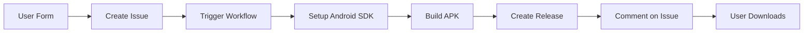

# 🚀 APK Builder - Serverless Website to Android App Converter

Convert any website into a standalone Android APK with one click - **completely serverless** using only GitHub infrastructure!

[](https://alltechdev.github.io/apk/)
[](https://pages.github.com/)
[](SERVERLESS.md)
[](https://github.com/pricing)

## ✨ Features

- 🌐 **100% Serverless** - No backend server needed
- 🆓 **Completely Free** - Uses GitHub's free tier
- ⚡ **Fast Builds** - APKs ready in 2-3 minutes
- 🎨 **Custom Branding** - Upload your own app icon
- 🔒 **Domain Restriction** - Lock app to specific websites
- 🚫 **Ad Blocker** - Built-in advertisement blocking
- 📱 **Orientation Control** - Portrait, landscape, or auto
- 🌍 **Global CDN** - Downloads served from GitHub's CDN
- 📦 **Unlimited Storage** - GitHub Releases for all APKs
- 🔍 **Public Audit Trail** - All builds tracked via Issues

## 🎯 Live Demo

**Try it now:** [https://alltechdev.github.io/apk/](https://alltechdev.github.io/apk/)

## 🏗️ How It Works

Our innovative serverless architecture uses GitHub infrastructure exclusively:

```
User → GitHub Pages → GitHub Issues → GitHub Actions → GitHub Releases
```

1. **User fills form** on GitHub Pages
2. **Creates GitHub Issue** with configuration
3. **GitHub Actions** automatically builds APK
4. **Uploads to Releases** with download link
5. **Comments on issue** when complete
6. **User downloads** APK from GitHub

👉 **[Read detailed architecture docs](SERVERLESS.md)**

## 💰 Cost: $0/month

| Resource | Free Tier | Usage |
|----------|-----------|-------|
| GitHub Pages | Unlimited | Frontend hosting |
| GitHub Actions | 2,000 min/month | ~1,000 APK builds |
| GitHub Releases | Unlimited | APK storage |
| GitHub Issues | Unlimited | Build queue |

**Total: FREE** within GitHub's free tier!

## 🚀 Quick Start

### Use the Live Site

1. Visit [https://alltechdev.github.io/apk/](https://alltechdev.github.io/apk/)
2. Enter your website URL
3. Customize settings (optional)
4. Click "Generate App"
5. Wait 2-3 minutes
6. Download your APK!

### Fork for Your Own Use

1. **Fork this repository**
   ```bash
   gh repo fork alltechdev/apk --clone
   cd apk
   ```

2. **Update configuration**
   Edit `docs/app.js`:
   ```javascript
   const GITHUB_OWNER = 'your-username';
   const GITHUB_REPO = 'apk';
   ```

3. **Enable GitHub Pages**
   - Go to Settings → Pages
   - Source: `docs/` folder
   - Save

4. **Done!** Your site is live at:
   ```
   https://your-username.github.io/apk/
   ```

## 📖 Documentation

- **[Serverless Architecture](SERVERLESS.md)** - How it all works
- **[Frontend Docs](docs/README.md)** - GitHub Pages setup
- **[Deployment Guide](DEPLOYMENT.md)** - Alternative deployments
- **[Contributing](CONTRIBUTING.md)** - How to contribute

## 🎨 Features in Detail

### Custom App Icon
- Upload any image
- Built-in cropping tool
- Automatically resized for all Android densities
- Square format enforced

### Domain Whitelisting
- Restrict navigation to main domain
- Add up to 3 additional domains
- Perfect for external login systems
- Prevents users from leaving your app

### Media & Ad Blocking
- Block images, videos, and embedded content
- Built-in ad blocker
- Reduces data usage
- Faster page loads

### SSL & Security
- Option to ignore SSL errors (for development)
- All builds are public and auditable
- No data collection
- Open source and transparent

### Orientation Control
- Auto (recommended)
- Force landscape
- Force portrait
- Set per-app

## 📊 Build Process



Average build time: **2-3 minutes**

## 🔧 Advanced Usage

### With Node.js Backend (Optional)

If you prefer a traditional server:
```bash
npm install
npm start
```

See [DEPLOYMENT.md](DEPLOYMENT.md) for details.

### With Docker

```bash
docker-compose up -d
```

### With GitHub Actions Only (Recommended)

```bash
# Already set up! Just use the live site
# https://alltechdev.github.io/apk/
```

## 📝 API Reference

### GitHub Issues Format

Create an issue with label `apk-build`:

```json
{
  "buildId": "build-1234567890",
  "domain": "example.com",
  "url": "example.com",
  "appName": "Example App",
  "blockMedia": false,
  "viewMode": "AUTO",
  "startUpUrl": "https://example.com",
  "adsBlocker": true,
  "noSslMode": false,
  "additionalDomains": []
}
```

The workflow will automatically process it!

## 🎯 Use Cases

- **Progressive Web Apps** - Distribute PWAs as APKs
- **Internal Tools** - Company intranet apps
- **Client Portals** - Custom-branded client access
- **Event Apps** - Quick apps for events/conferences
- **Testing** - Test websites in app context
- **Kiosks** - Locked-down tablet apps
- **Education** - Learning platform apps

## 🌟 Why This Project?

### Problem
Creating Android apps from websites traditionally requires:
- Android Studio
- Java/Kotlin knowledge
- Build server
- Signing keys
- Distribution infrastructure

### Solution
We use GitHub's infrastructure to:
- ✅ Build APKs automatically
- ✅ Host frontend for free
- ✅ Store APKs indefinitely
- ✅ Queue builds via Issues
- ✅ Track everything publicly
- ✅ Scale automatically

**Result: Anyone can create Android apps with zero setup!**

## 📈 Limitations

- GitHub Actions: 2,000 free minutes/month (~1,000 builds)
- Build timeout: 15 minutes per APK
- All builds are public
- No automatic app signing (debug keys used)
- Manual submission to Play Store required

## 🤝 Contributing

Contributions welcome! This project is:
- ✅ Open source (MIT license)
- ✅ Beginner-friendly
- ✅ Well-documented
- ✅ Actively maintained

See [CONTRIBUTING.md](CONTRIBUTING.md) for guidelines.

## 🙏 Credits

- **Android Template:** [AndroidRestrictedWebView](https://github.com/lo-mityaesh/AndroidRestrictedWebView) by @lo-mityaesh
- **Original Inspiration:** app-builder.madrichim.ovh (archived)
- **Infrastructure:** GitHub (Pages, Actions, Releases)

## 📜 License

MIT License - use freely for any purpose!

## 🔗 Links

- **Live App:** https://alltechdev.github.io/apk/
- **GitHub Repo:** https://github.com/alltechdev/apk
- **Issues/Builds:** https://github.com/alltechdev/apk/issues
- **Releases/Downloads:** https://github.com/alltechdev/apk/releases
- **Discussions:** https://github.com/alltechdev/apk/discussions

---

**Made with ❤️ using only GitHub infrastructure**

[⭐ Star this repo](https://github.com/alltechdev/apk) if you find it useful!
